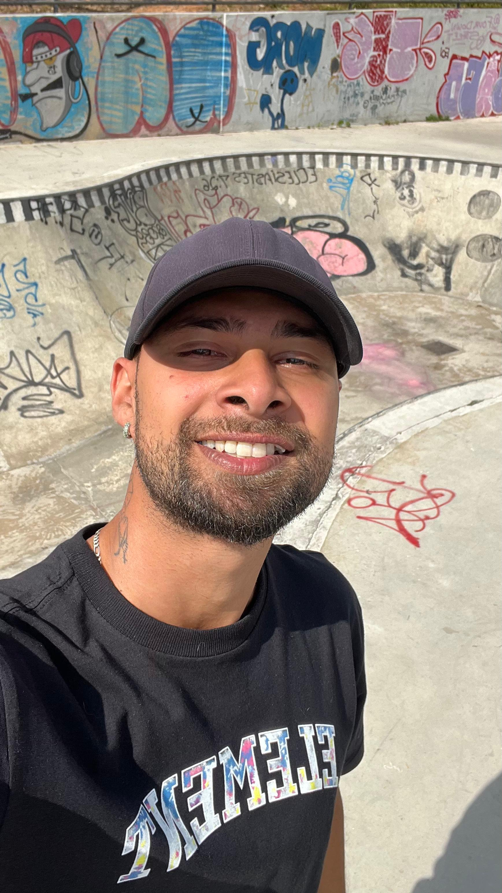

<!DOCTYPE html>
<html>
<head>
    <meta charset="UTF-8">
  <link rel="stylesheet" href="style.css">
</head>
<body>
  <header>
    

      
    

    <nav>
      <ul>
        <li><a href="http://wa.me/5531975208688" class="btn">Contato</a></li>
        <li><a href="curriculo.pdf" class="btn">Currículo</a></li>
        <li><a href="https://github.com/Victor-Jhon" class="btn">Projetos</a></li>
        <li><a href="certificado testes automatizados selenium e java.jpg " class="btn">Certificado</a></li>
        <li><a href="https://www.instagram.com/victorjhon_/" class="btn">Instagram</a></li>
      </ul>
    </nav>
  </header>
  <main>
    

    

      <!-- Aqui vai a descrição do meu trabalho -->
    <h1 class="titulo">Olá, tudo bem? meu nome é Victor Jhon.</h1>
    
"Sou um entusiasta da qualidade de software e programação, com foco em testes automatizados e Quality Assurance. Estou estudando frameworks como Selenium e JUnit para melhorar minhas habilidades em testes. Além disso, sou apaixonado por games, novas tecnologias, carros e amante da natureza. Estou sempre procurando aprender e melhorar minhas habilidades para contribuir para projetos inovadores."

    

  </main>
</body>
</html>
